# ggplot2 (60 minutos)

## Carrega pacotes a serem usados


```r
#install.packages("tidyverse") 
#install.packages("dplyr")     
#install.packages("tidyr")     
#install.packages("ggplot2")   

library(tidyverse)
# Manipulação de dados
#library(dplyr)

# Visualização de gráficos
library(ggplot2)
library(gridExtra)
library(patchwork)
library(plotly)
library(esquisse)

# Para dados gráfico de perfis
library(nlme)
```

Alguns links

[The R Graph Gallery](https://r-graph-gallery.com/)

[120 registered extensions available to explore](https://exts.ggplot2.tidyverse.org/gallery/)

[link 1: patchwork](https://patchwork.data-imaginist.com/articles/guides/assembly.html)

[link 2: patchwork](https://patchwork.data-imaginist.com/articles/patchwork.html)


## Lista de funções do pacote ggplot2


```r
ls("package:ggplot2")
```

## Primeiros passos usando geom_point


```r
dados <- mpg
ggplot(dados)
```


```r
ggplot(dados, aes(x = cty, y = hwy))
```

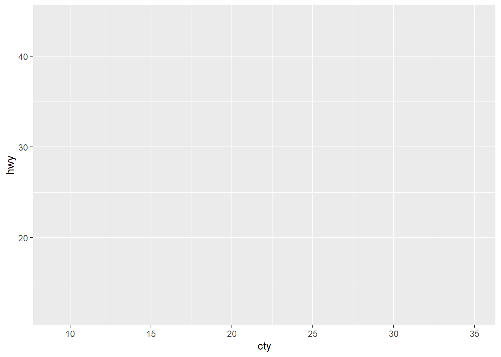

```r
# Alternativas
ggplot(dados, aes(x = cty, y = hwy)) + 
  geom_point()
```


```r
ggplot(dados) + 
  geom_point(aes(x = cty, y = hwy))
```


```r
ggplot() + 
  geom_point(data = dados, aes(x = cty, y = hwy))
```


```r
# Fim 

ggplot(dados, aes(x = cty, y = hwy)) + 
  geom_point(colour = "red")
```


```r
ggplot(dados, aes(x = cty, y = hwy)) + 
  geom_point(colour = "red", size = 6)
```


```r
ggplot(dados, aes(x = cty, y = hwy)) + 
  geom_point(colour = "red", size = 6, shape = 10)
```


```r
# Alternativa
ggplot(dados, aes(x = cty, y = hwy)) + 
  geom_point(colour = "red", size = 6, shape = "circle plus")
```


```r
ggplot(dados, aes(x = cty, y = hwy)) + 
  geom_point(colour = "red", size = 6, shape = 10)+
  labs(x = "cty (city miles per gallon hwy)", 
       y = "hwy (highway miles per gallon)", 
       title = "Pensar em algum título...", 
       subtitle = "Escrever alguma coisa")
```


### Mais detalhes sobre geom_point 

> geom_point() understands the following aesthetics (required aesthetics are in bold):

  - x

  - y

  - alpha

  - colour

  - fill

  - group

  - shape

  - size

  - stroke
  

```r
ggplot(dados, aes(x = cty, y = hwy)) + 
  geom_point()
```


```r
ggplot(dados, aes(x = cty, y = hwy, col = factor(year))) + 
  geom_point() + 
  labs(col = "year")
```


```r
# Alternativa
ggplot(dados, aes(x = cty, y = hwy, col = factor(class))) + 
  geom_point() + 
  labs(col = "class")+
  scale_color_brewer(type = "qual")
```


```r
ggplot(dados, aes(x = cty, y = hwy, col = factor(class))) + 
  geom_point() + 
  labs(col = "class")+
  scale_color_brewer(type = "div")
```


```r
ggplot(dados, aes(x = cty, y = hwy, col = factor(class))) + 
  geom_point() + 
  labs(col = "class")+
  scale_color_brewer(palette = "Set1", name = "Tipo de carro")+
  scale_y_continuous(breaks = seq(10,60,3))+
  scale_x_continuous(breaks = seq(10,40,3))+
  theme_minimal()
```


```r
ggplot(dados, aes(x = cty, y = hwy, alpha = factor(year))) + 
  geom_point() + 
  labs(alpha = "year")
```


```r
ggplot(dados, aes(x = cty, y = hwy, size = factor(year))) + 
  geom_point() + 
  labs(size = "year")
```


```r
# Alternativa
ggplot(dados, aes(x = cty, y = hwy, col = cty <= 20)) + 
  geom_point() + 
  geom_vline(xintercept = 20)+
  labs(col = "year")
```

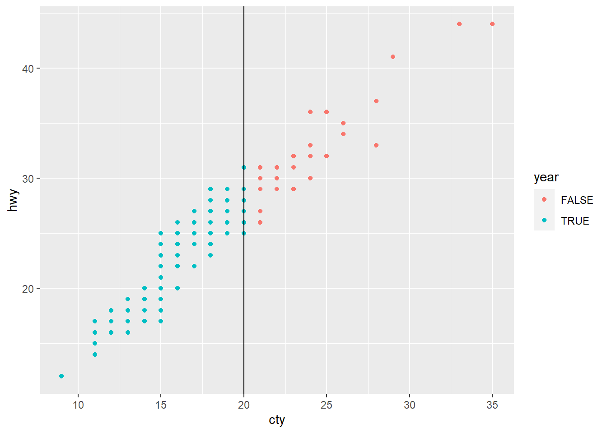

```r
# Erro comum
ggplot(dados, aes(x = cty, y = hwy, col = "red")) + 
  geom_point()+
  labs(col = "year")
```

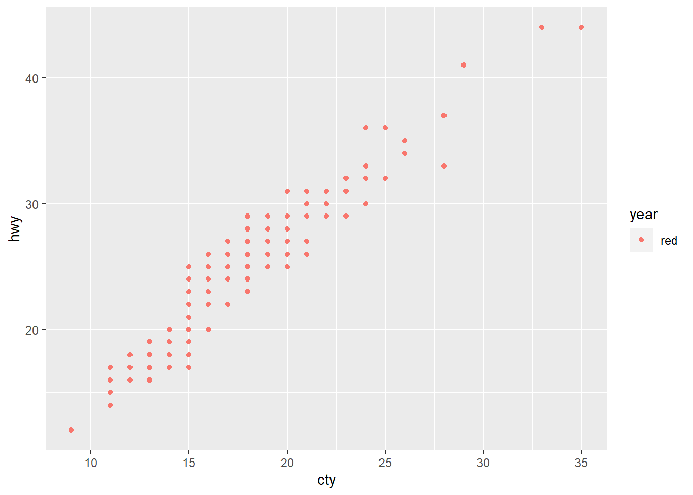

```r
ggplot(dados, aes(x = cty, y = hwy)) + 
  geom_point(col = "red")+
  labs(col = "year")
```


```r
# Fim  Erro comum

ggplot(dados, aes(x = cty, y = hwy, shape = factor(year))) + 
  geom_point(col = "red") + 
  labs(shape = "year")
```


```r
ggplot(dados, aes(x = cty, y = hwy, size = class)) + 
  geom_point() + 
  labs(size = "class")
```


```r
ggplot(dados, aes(x = cty, y = hwy, 
                  size = class, 
                  col = class)) + 
  geom_point() + 
  guides(colour = guide_legend("Tipo de carro (color)"),
         size = guide_legend("Tipo de carro (size)"))
```


```r
ggplot(dados, aes(x = cty, y = hwy, 
                  size = class, 
                  col = class)) + 
  geom_point() + 
  labs(col = "Tipo de Carro", size = "Tipo de Carro")+
  guides(col = "legend")
```


## smooth, boxplot, histogram


```r
v1<- ggplot(dados, aes(x = cty, y = hwy)) + 
  geom_point(col = "blue")+
  geom_smooth(method = mgcv::gam,
              formula = y ~ s(x, bs = "cs") ,
              col = "red", 
              se = FALSE)
v1
```

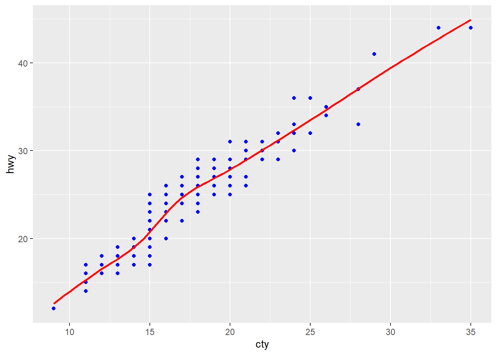

```r
v2 <- ggplot(dados, aes(x = cty)) + 
  geom_boxplot(fill = "red")
v2
```


```r
v3 <- ggplot(dados, aes(x = cty)) + 
  geom_histogram(bins = 10, fill = "red", col = "blue", lwd=2)
v3
```


```r
v4<- ggplot(dados, aes(x = cty)) + 
  geom_histogram(aes(y = after_stat(density)),
                 bins = 10, fill = "yellow", col = "red") +
  geom_density(col = "blue", lwd =3)
v4
```

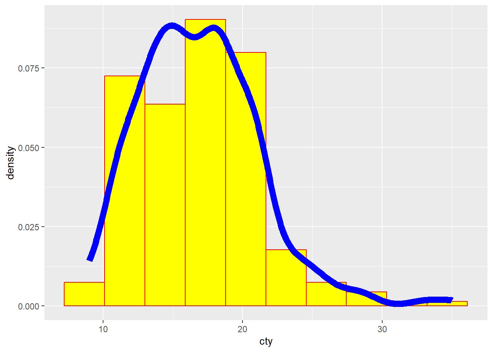

```r
# Adicional (estatístic experimental)
ggplot(dados, aes(x = drv, y = cty, col = drv)) + 
  geom_boxplot()+
  theme_bw()+
  theme(legend.position = "none")
```

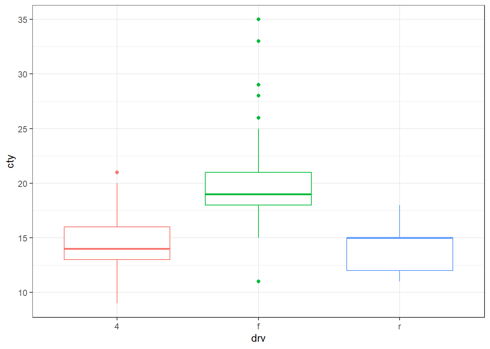

## gridExtra e patchwork


Alguns links

[link 1: patchwork](https://patchwork.data-imaginist.com/articles/guides/assembly.html)

[link 2: patchwork](https://patchwork.data-imaginist.com/articles/patchwork.html)


```r
# gridExtra
grid.arrange(v1, v2, v3, v4) 
```


```r
# patchwork
v1 + v2
```


```r
v1 | v2
```


```r
v1 / v2
```

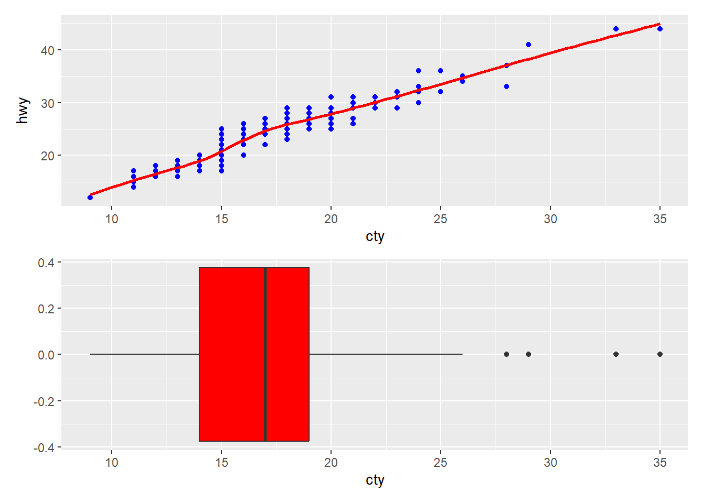

```r
v1 + v2 + v3
```


```r
v1 + (v2 + v3)
```

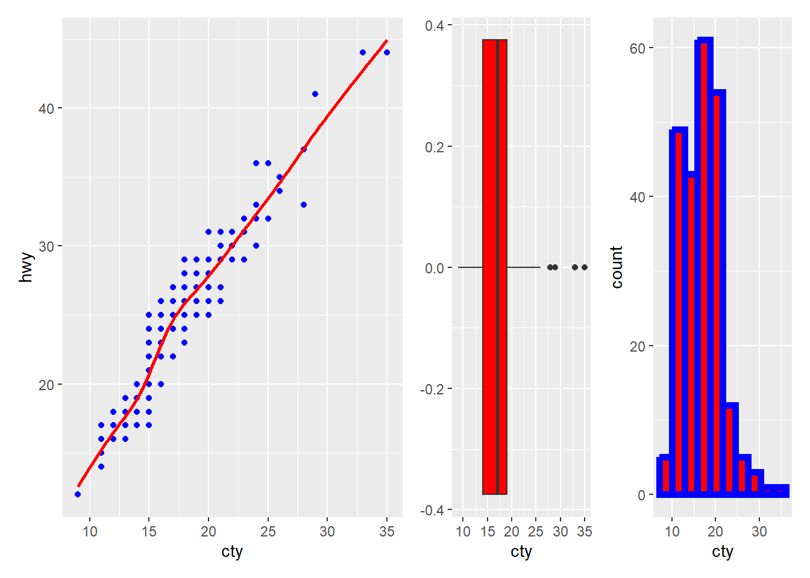

```r
v1 | (v2 / v3)
```


```r
v1 / (v2 + v3)
```


```r
v1 + v2 + v3 + v4 
```


```r
v1/(v2+v3+v4)
```


```r
v1  + (v2 + v3 + v4)
```

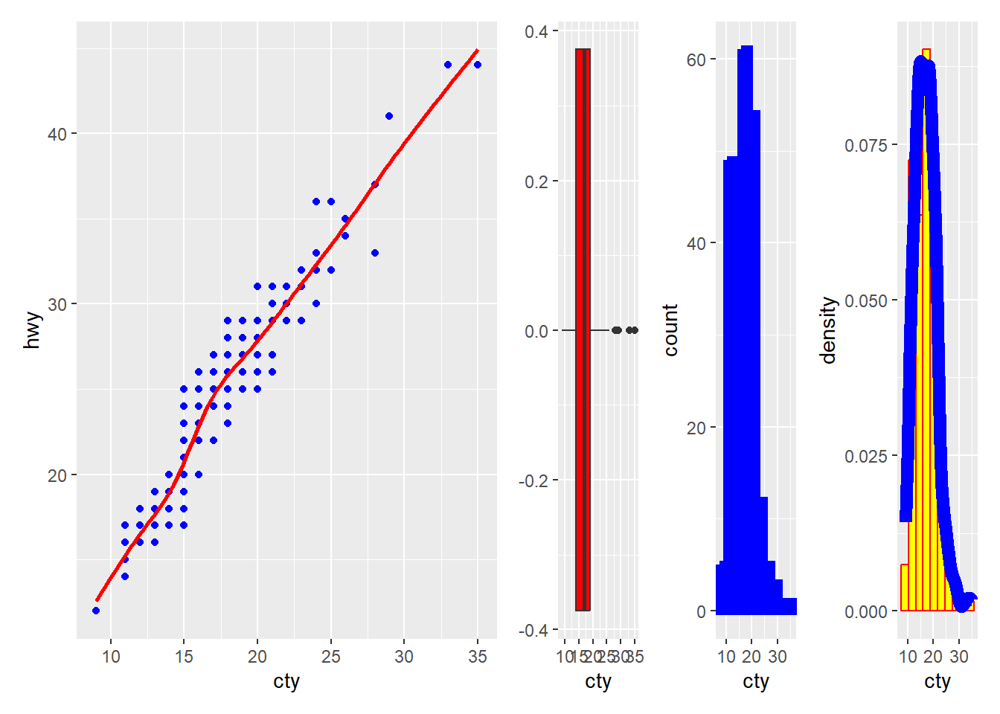

```r
v1  + v2 + (v3 + v4)
```

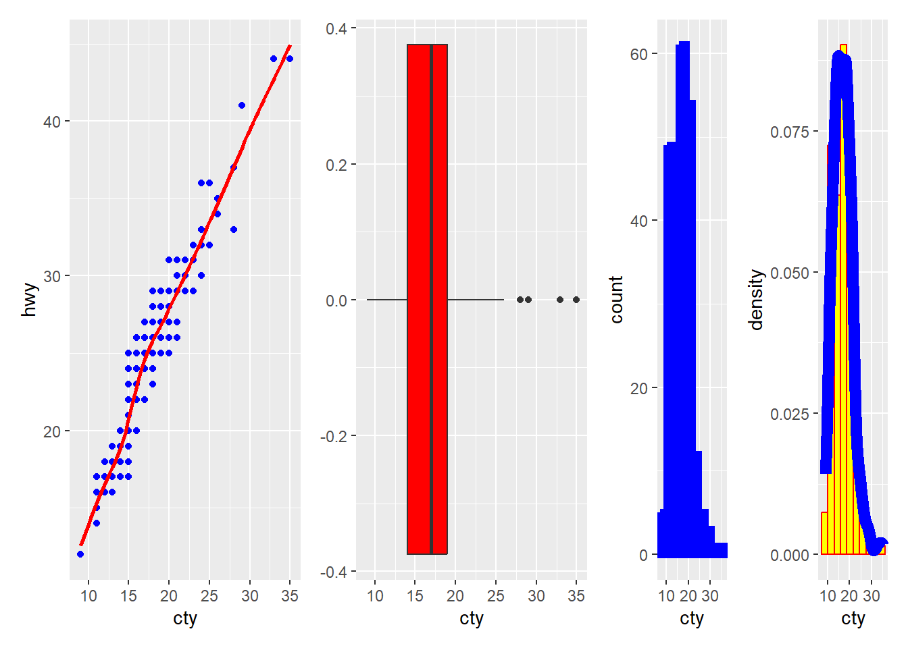

```r
(v1 | v2 | v3) / v4
```


## bar, col, density, density2d


```r
v5 <- ggplot(dados , aes(x = manufacturer)) + 
  geom_bar()+ 
  theme(axis.text.x = element_text(angle = 45))
v5
```

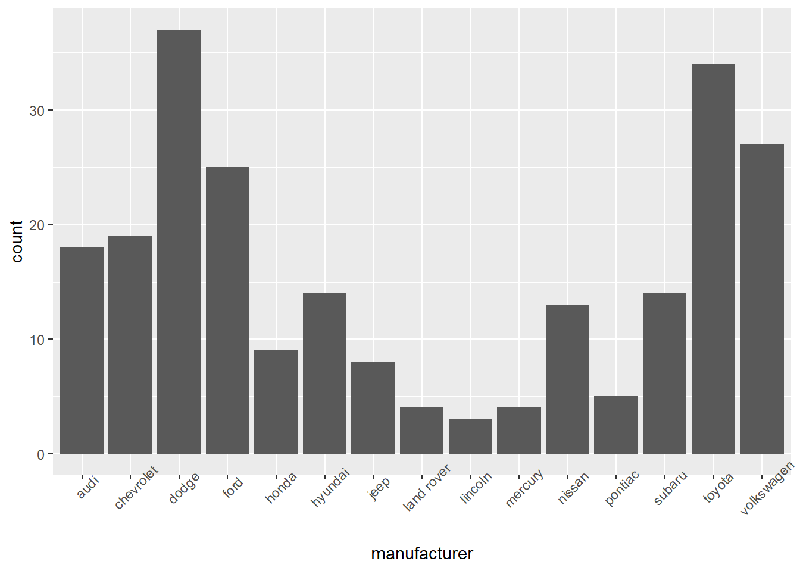

```r
# Dúvidas no geom_col
v6 <- ggplot(dados , aes(x = manufacturer, y = cty)) + 
  geom_col()+
  theme(axis.text.x = element_text(angle = 45))
v6
```

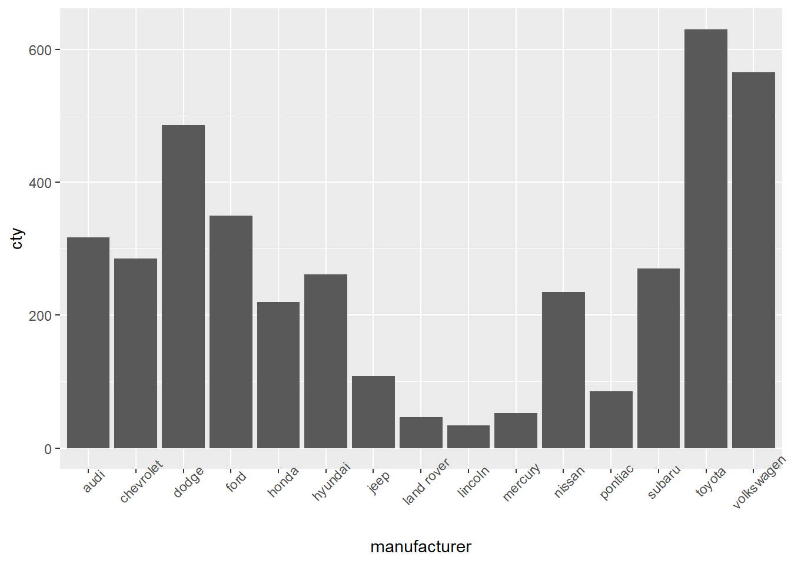

```r
dados %>% 
  select(manufacturer, cty) %>% 
  group_by(manufacturer) %>% 
  summarise(soma_total_cty = sum(cty),
            n = n())
```

```
## # A tibble: 15 × 3
##    manufacturer soma_total_cty     n
##    <chr>                 <int> <int>
##  1 audi                    317    18
##  2 chevrolet               285    19
##  3 dodge                   486    37
##  4 ford                    350    25
##  5 honda                   220     9
##  6 hyundai                 261    14
##  7 jeep                    108     8
##  8 land rover               46     4
##  9 lincoln                  34     3
## 10 mercury                  53     4
## 11 nissan                  235    13
## 12 pontiac                  85     5
## 13 subaru                  270    14
## 14 toyota                  630    34
## 15 volkswagen              565    27
```

```r
# dados %>% 
#   filter(manufacturer == "audi") %>% 
#   select(cty) %>% 
#   sum()
v7 <- ggplot(dados , aes(x = cty)) + 
  geom_density()
v7
```


```r
v8 <- ggplot(dados, aes(x = cty, y = hwy)) + 
  geom_density2d()+
  geom_point(colour = "red")
v8
```

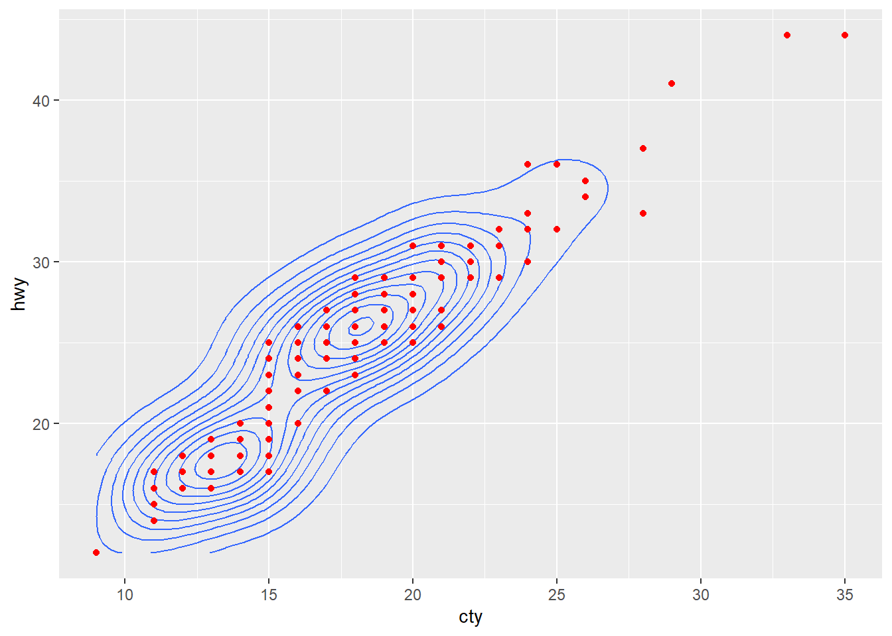

```r
(v5+v6)/ (v7 + v8)
```


```r
# Deixar pra depois...
 dados %>% 
    select(manufacturer, hwy, year) %>% 
    filter(manufacturer == "audi", year == "1999") %>% 
    summarise(media = max(hwy))
```

```
## # A tibble: 1 × 1
##   media
##   <int>
## 1    29
```


```r
# plotly
ggplotly(
ggplot(dados, aes(x = manufacturer, y = hwy, fill = factor(year))) + 
  geom_col(position = "dodge") + 
  labs(fill = "year") +
  theme(axis.text.x = element_text(angle = 45)))

dados %>% select(manufacturer, hwy, year) %>% 
  group_by(manufacturer, year) %>% 
  summarise(media = mean(hwy))
```


```r
# Para pensar

(dados_trat <- data.frame(tratamento = LETTERS[1:3], 
                         resposta = c(2.3, 1.9, 3.2)))
```

```
##   tratamento resposta
## 1          A      2.3
## 2          B      1.9
## 3          C      3.2
```

```r
ggplot(dados_trat, aes(tratamento, resposta)) +
  geom_col(fill = "red")
```


```r
# Mais detalhes...
dados %>% select(manufacturer, hwy, year) %>% 
  group_by(manufacturer, year) %>% 
  summarise(media = mean(hwy), .groups = "drop") %>% 
  ggplot(aes(x = manufacturer, y = media, fill = factor(year)))+
  geom_col(position = "dodge")+
  labs(fill = "year") +
  theme(axis.text.x = element_text(angle = 45))
```

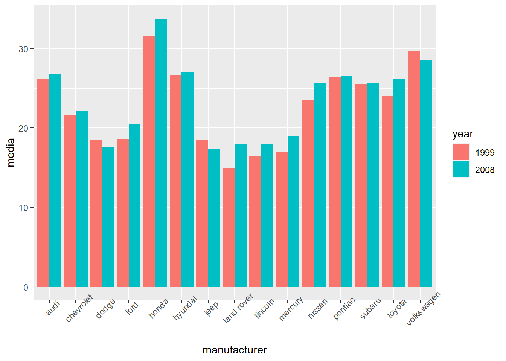

## facet_grid, facet_wrap


```r
p1<- ggplot(dados, aes(x = cty, y = hwy)) +
  geom_point()
p1
```


```r
p1 + facet_grid(rows = vars(cyl))
```

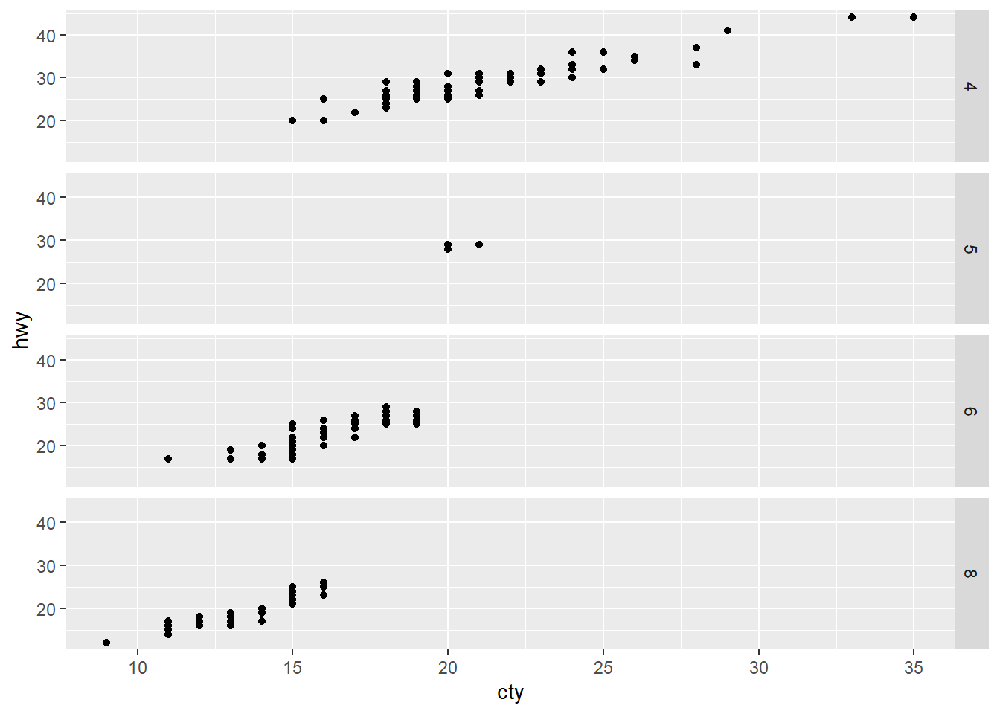

```r
p1 + facet_grid(cols = vars(cyl))
```

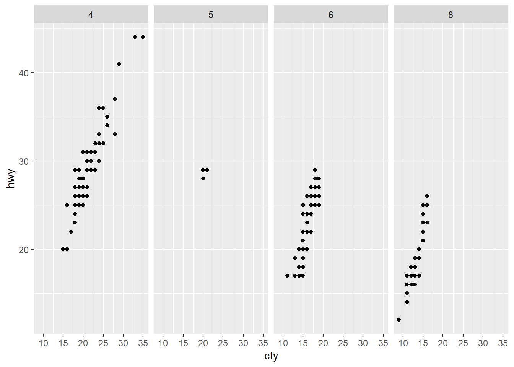

```r
p1 + facet_grid(~cyl)
```


```r
p1 + facet_grid(rows = vars(year), cols =vars(cyl))
```


```r
p1 + facet_grid(year~cyl)
```


```r
p1 + facet_wrap(year ~ cyl)
```


```r
p1 + facet_wrap(cyl ~ year)
```


```r
p1 + facet_wrap(~cyl + year)
```

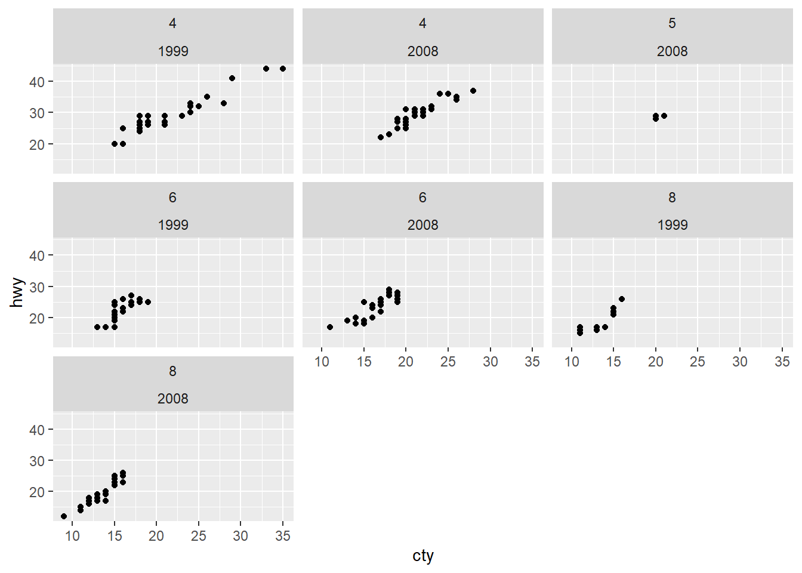

```r
p1 + facet_wrap(~year + cyl)
```


```r
p1 + facet_wrap(year ~ cyl, ncol = 4)
```


```r
p1 + facet_wrap(cyl ~ year, ncol = 4)
```


## stat_function


```r
a<- -3 # média
b<- 4  # desv. padrão
ggplot(data.frame(x = c(a - 3*b, a + 3*b)), aes(x)) + 
  stat_function(fun = dnorm, args = list(mean = a, sd = b))+
  geom_vline(xintercept = c(a - 3*b, a, a + 3*b), col = "red", lty = 2)+
  theme_minimal()
```


## stat_summary


```r
ggplot(dados, aes(x = manufacturer, y = hwy)) + 
  geom_boxplot()+
  geom_point(col = "red", size=0.8)+
  stat_summary(fun = mean, col = "blue")+
  theme_minimal()+
  theme(axis.text.x = element_text(angle = 45))
```


## theme_*()


```r
a1<- p1 + theme_bw() + labs(title = "theme_bw()")
a2<- p1 + theme_classic() + labs(title = "theme_classic()")
a3<- p1 + theme_light() + labs(title = "theme_light()")
a4<- p1 + theme_minimal() + labs(title = "theme_minimal()")

a1 + a2 + a3 + a4
```


## Gráfico de perfis (Spaguetti plot)


```r
glimpse(Orange)
```

```
## Rows: 35
## Columns: 3
## $ Tree          <ord> 1, 1, 1, 1, 1, 1, 1, 2, 2, 2, 2, 2, 2, 2, 3, 3, 3, 3, 3,…
## $ age           <dbl> 118, 484, 664, 1004, 1231, 1372, 1582, 118, 484, 664, 10…
## $ circumference <dbl> 30, 58, 87, 115, 120, 142, 145, 33, 69, 111, 156, 172, 2…
```

```r
ggplot(Orange, aes(x = age, y = circumference, group = Tree, 
                   col = Tree)) +
  geom_line()+
  stat_summary(aes(group = 1), fun = mean, col = "red", 
               geom = "line", size = 1, show.legend = FALSE,
               linetype = 2)+
  xlim(0, 1600)+
  theme_minimal()
```


```r
ggplot(Orange, aes(x = age, y = circumference, group = Tree)) +
  geom_line()+
  xlim(0, 1600)+
  facet_wrap(~Tree)+
  theme_minimal()+
  theme(legend.position = "none")
```

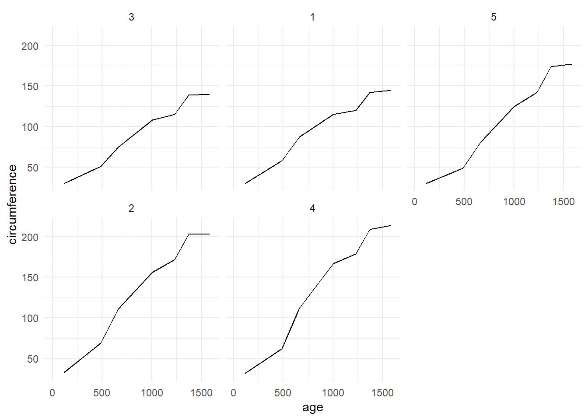

## plotly

[plotly cran](https://cran.r-project.org/web/packages/plotly/index.html)

[Interactive web-based data visualization with R, plotly, and shiny](https://plotly-r.com/)

[Plotly R Open Source Graphing Library](https://plotly.com/r/)


```r
ggplotly(v1)
ggplotly(v2)
ggplotly(v4)
ggplotly(v5)
```


## esquisse

Alguns links de interesse

[esquisse](https://cran.r-project.org/web/packages/esquisse/vignettes/get-started.html)

[esquisse + shiny](https://cran.r-project.org/web/packages/esquisse/vignettes/shiny-usage.html)


```r
esquisser(dados)
```

## Exemplo esquisse


```r
ggplot(dados) +
  aes(x = displ, y = hwy, colour = drv) +
  geom_point(shape = "circle", size = 1.85) +
  scale_color_hue(direction = 1) +
  theme_minimal() +
  theme(legend.position = "top")
```


```r
ggplot(dados) +
  aes(x = displ, y = cty, colour = class, size = cty) +
  geom_point(shape = "circle") +
  scale_color_hue(direction = 1) +
  theme(legend.position = "top") +
  facet_wrap(vars(drv))
```


