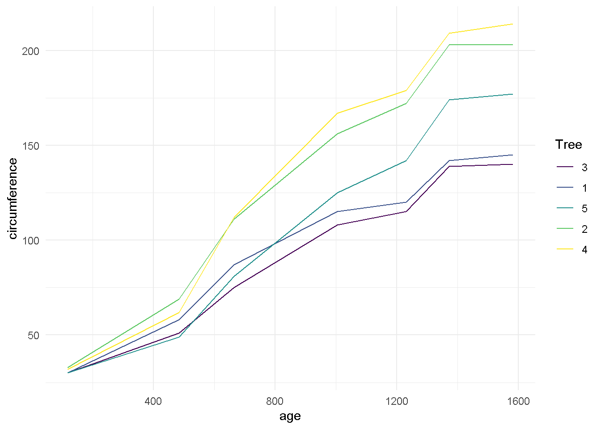

# tidyr

More details in [https://tidyr.tidyverse.org/articles/nest.html](https://tidyr.tidyverse.org/articles/nest.html)

## nest()


```r
library(tidyverse)

mtcars %>% 
  group_by(cyl) %>% 
  nest() 
```

```
## # A tibble: 3 × 2
## # Groups:   cyl [3]
##     cyl data              
##   <dbl> <list>            
## 1     6 <tibble [7 × 10]> 
## 2     4 <tibble [11 × 10]>
## 3     8 <tibble [14 × 10]>
```

```r
um<- mtcars %>% 
  group_by(cyl) %>% 
  nest() %>%
  mutate(
    linMod = map(data, ~lm(mpg ~ wt, data = .)),
    coeffs = map(linMod, coefficients),
    slope = map_dbl(coeffs, 2))
um
```

```
## # A tibble: 3 × 5
## # Groups:   cyl [3]
##     cyl data               linMod coeffs    slope
##   <dbl> <list>             <list> <list>    <dbl>
## 1     6 <tibble [7 × 10]>  <lm>   <dbl [2]> -2.78
## 2     4 <tibble [11 × 10]> <lm>   <dbl [2]> -5.65
## 3     8 <tibble [14 × 10]> <lm>   <dbl [2]> -2.19
```

```r
um$linMod
```

```
## [[1]]
## 
## Call:
## lm(formula = mpg ~ wt, data = .)
## 
## Coefficients:
## (Intercept)           wt  
##       28.41        -2.78  
## 
## 
## [[2]]
## 
## Call:
## lm(formula = mpg ~ wt, data = .)
## 
## Coefficients:
## (Intercept)           wt  
##      39.571       -5.647  
## 
## 
## [[3]]
## 
## Call:
## lm(formula = mpg ~ wt, data = .)
## 
## Coefficients:
## (Intercept)           wt  
##      23.868       -2.192
```

```r
um$coeffs
```

```
## [[1]]
## (Intercept)          wt 
##   28.408845   -2.780106 
## 
## [[2]]
## (Intercept)          wt 
##   39.571196   -5.647025 
## 
## [[3]]
## (Intercept)          wt 
##   23.868029   -2.192438
```

```r
um$slope
```

```
## [1] -2.780106 -5.647025 -2.192438
```

```r
um$linMod[[1]]
```

```
## 
## Call:
## lm(formula = mpg ~ wt, data = .)
## 
## Coefficients:
## (Intercept)           wt  
##       28.41        -2.78
```

```r
dois<- mtcars %>% 
  group_by(cyl) %>% 
  nest() %>% 
  mutate(model = map(data, function(df) lm(mpg ~ wt, data = df)))
dois
```

```
## # A tibble: 3 × 3
## # Groups:   cyl [3]
##     cyl data               model 
##   <dbl> <list>             <list>
## 1     6 <tibble [7 × 10]>  <lm>  
## 2     4 <tibble [11 × 10]> <lm>  
## 3     8 <tibble [14 × 10]> <lm>
```

```r
dois$cyl
```

```
## [1] 6 4 8
```

```r
dois$data
```

```
## [[1]]
## # A tibble: 7 × 10
##     mpg  disp    hp  drat    wt  qsec    vs    am  gear  carb
##   <dbl> <dbl> <dbl> <dbl> <dbl> <dbl> <dbl> <dbl> <dbl> <dbl>
## 1  21    160    110  3.9   2.62  16.5     0     1     4     4
## 2  21    160    110  3.9   2.88  17.0     0     1     4     4
## 3  21.4  258    110  3.08  3.22  19.4     1     0     3     1
## 4  18.1  225    105  2.76  3.46  20.2     1     0     3     1
## 5  19.2  168.   123  3.92  3.44  18.3     1     0     4     4
## 6  17.8  168.   123  3.92  3.44  18.9     1     0     4     4
## 7  19.7  145    175  3.62  2.77  15.5     0     1     5     6
## 
## [[2]]
## # A tibble: 11 × 10
##      mpg  disp    hp  drat    wt  qsec    vs    am  gear  carb
##    <dbl> <dbl> <dbl> <dbl> <dbl> <dbl> <dbl> <dbl> <dbl> <dbl>
##  1  22.8 108      93  3.85  2.32  18.6     1     1     4     1
##  2  24.4 147.     62  3.69  3.19  20       1     0     4     2
##  3  22.8 141.     95  3.92  3.15  22.9     1     0     4     2
##  4  32.4  78.7    66  4.08  2.2   19.5     1     1     4     1
##  5  30.4  75.7    52  4.93  1.62  18.5     1     1     4     2
##  6  33.9  71.1    65  4.22  1.84  19.9     1     1     4     1
##  7  21.5 120.     97  3.7   2.46  20.0     1     0     3     1
##  8  27.3  79      66  4.08  1.94  18.9     1     1     4     1
##  9  26   120.     91  4.43  2.14  16.7     0     1     5     2
## 10  30.4  95.1   113  3.77  1.51  16.9     1     1     5     2
## 11  21.4 121     109  4.11  2.78  18.6     1     1     4     2
## 
## [[3]]
## # A tibble: 14 × 10
##      mpg  disp    hp  drat    wt  qsec    vs    am  gear  carb
##    <dbl> <dbl> <dbl> <dbl> <dbl> <dbl> <dbl> <dbl> <dbl> <dbl>
##  1  18.7  360    175  3.15  3.44  17.0     0     0     3     2
##  2  14.3  360    245  3.21  3.57  15.8     0     0     3     4
##  3  16.4  276.   180  3.07  4.07  17.4     0     0     3     3
##  4  17.3  276.   180  3.07  3.73  17.6     0     0     3     3
##  5  15.2  276.   180  3.07  3.78  18       0     0     3     3
##  6  10.4  472    205  2.93  5.25  18.0     0     0     3     4
##  7  10.4  460    215  3     5.42  17.8     0     0     3     4
##  8  14.7  440    230  3.23  5.34  17.4     0     0     3     4
##  9  15.5  318    150  2.76  3.52  16.9     0     0     3     2
## 10  15.2  304    150  3.15  3.44  17.3     0     0     3     2
## 11  13.3  350    245  3.73  3.84  15.4     0     0     3     4
## 12  19.2  400    175  3.08  3.84  17.0     0     0     3     2
## 13  15.8  351    264  4.22  3.17  14.5     0     1     5     4
## 14  15    301    335  3.54  3.57  14.6     0     1     5     8
```

```r
dois$model
```

```
## [[1]]
## 
## Call:
## lm(formula = mpg ~ wt, data = df)
## 
## Coefficients:
## (Intercept)           wt  
##       28.41        -2.78  
## 
## 
## [[2]]
## 
## Call:
## lm(formula = mpg ~ wt, data = df)
## 
## Coefficients:
## (Intercept)           wt  
##      39.571       -5.647  
## 
## 
## [[3]]
## 
## Call:
## lm(formula = mpg ~ wt, data = df)
## 
## Coefficients:
## (Intercept)           wt  
##      23.868       -2.192
```

```r
dois$model[[3]]
```

```
## 
## Call:
## lm(formula = mpg ~ wt, data = df)
## 
## Coefficients:
## (Intercept)           wt  
##      23.868       -2.192
```

```r
tres<- dois %>% 
  mutate(model = map(model, predict))

tres
```

```
## # A tibble: 3 × 3
## # Groups:   cyl [3]
##     cyl data               model     
##   <dbl> <list>             <list>    
## 1     6 <tibble [7 × 10]>  <dbl [7]> 
## 2     4 <tibble [11 × 10]> <dbl [11]>
## 3     8 <tibble [14 × 10]> <dbl [14]>
```

```r
tres$model
```

```
## [[1]]
##        1        2        3        4        5        6        7 
## 21.12497 20.41604 19.47080 18.78968 18.84528 18.84528 20.70795 
## 
## [[2]]
##        1        2        3        4        5        6        7        8 
## 26.47010 21.55719 21.78307 27.14774 30.45125 29.20890 25.65128 28.64420 
##        9       10       11 
## 27.48656 31.02725 23.87247 
## 
## [[3]]
##        1        2        3        4        5        6        7        8 
## 16.32604 16.04103 14.94481 15.69024 15.58061 12.35773 11.97625 12.14945 
##        9       10       11       12       13       14 
## 16.15065 16.33700 15.44907 15.43811 16.91800 16.04103
```

```r
tres$model[[3]]
```

```
##        1        2        3        4        5        6        7        8 
## 16.32604 16.04103 14.94481 15.69024 15.58061 12.35773 11.97625 12.14945 
##        9       10       11       12       13       14 
## 16.15065 16.33700 15.44907 15.43811 16.91800 16.04103
```

## unnest()


```r
um %>% 
  unnest(data)
```

```
## # A tibble: 32 × 14
## # Groups:   cyl [3]
##      cyl   mpg  disp    hp  drat    wt  qsec    vs    am  gear  carb linMod
##    <dbl> <dbl> <dbl> <dbl> <dbl> <dbl> <dbl> <dbl> <dbl> <dbl> <dbl> <list>
##  1     6  21    160    110  3.9   2.62  16.5     0     1     4     4 <lm>  
##  2     6  21    160    110  3.9   2.88  17.0     0     1     4     4 <lm>  
##  3     6  21.4  258    110  3.08  3.22  19.4     1     0     3     1 <lm>  
##  4     6  18.1  225    105  2.76  3.46  20.2     1     0     3     1 <lm>  
##  5     6  19.2  168.   123  3.92  3.44  18.3     1     0     4     4 <lm>  
##  6     6  17.8  168.   123  3.92  3.44  18.9     1     0     4     4 <lm>  
##  7     6  19.7  145    175  3.62  2.77  15.5     0     1     5     6 <lm>  
##  8     4  22.8  108     93  3.85  2.32  18.6     1     1     4     1 <lm>  
##  9     4  24.4  147.    62  3.69  3.19  20       1     0     4     2 <lm>  
## 10     4  22.8  141.    95  3.92  3.15  22.9     1     0     4     2 <lm>  
## # … with 22 more rows, and 2 more variables: coeffs <list>, slope <dbl>
```


## Exemplos da ajuda do R


```r
df <- tibble(x = c(1, 1, 1, 2, 2, 3), 
             y = 1:6, 
             z = 6:1)
df
```

```
## # A tibble: 6 × 3
##       x     y     z
##   <dbl> <int> <int>
## 1     1     1     6
## 2     1     2     5
## 3     1     3     4
## 4     2     4     3
## 5     2     5     2
## 6     3     6     1
```

```r
# Note that we get one row of output for each unique combination of
# non-nested variables
df %>% 
  nest(data = c(y, z))
```

```
## # A tibble: 3 × 2
##       x data            
##   <dbl> <list>          
## 1     1 <tibble [3 × 2]>
## 2     2 <tibble [2 × 2]>
## 3     3 <tibble [1 × 2]>
```

```r
# chop does something similar, but retains individual columns
df %>% 
  chop(c(y, z))
```

```
## # A tibble: 3 × 3
##       x           y           z
##   <dbl> <list<int>> <list<int>>
## 1     1         [3]         [3]
## 2     2         [2]         [2]
## 3     3         [1]         [1]
```

```r
# use tidyselect syntax and helpers, just like in dplyr::select()
df %>% 
  nest(data = any_of(c("y", "z")))
```

```
## # A tibble: 3 × 2
##       x data            
##   <dbl> <list>          
## 1     1 <tibble [3 × 2]>
## 2     2 <tibble [2 × 2]>
## 3     3 <tibble [1 × 2]>
```

```r
iris %>% 
  nest(data = !Species)
```

```
## # A tibble: 3 × 2
##   Species    data             
##   <fct>      <list>           
## 1 setosa     <tibble [50 × 4]>
## 2 versicolor <tibble [50 × 4]>
## 3 virginica  <tibble [50 × 4]>
```

```r
nest_vars <- names(iris)[1:4]
iris %>% 
  nest(data = any_of(nest_vars))
```

```
## # A tibble: 3 × 2
##   Species    data             
##   <fct>      <list>           
## 1 setosa     <tibble [50 × 4]>
## 2 versicolor <tibble [50 × 4]>
## 3 virginica  <tibble [50 × 4]>
```

```r
iris %>%
  nest(petal = starts_with("Petal"), sepal = starts_with("Sepal"))
```

```
## # A tibble: 3 × 3
##   Species    petal             sepal            
##   <fct>      <list>            <list>           
## 1 setosa     <tibble [50 × 2]> <tibble [50 × 2]>
## 2 versicolor <tibble [50 × 2]> <tibble [50 × 2]>
## 3 virginica  <tibble [50 × 2]> <tibble [50 × 2]>
```

```r
iris %>%
  nest(width = contains("Width"), length = contains("Length"))
```

```
## # A tibble: 3 × 3
##   Species    width             length           
##   <fct>      <list>            <list>           
## 1 setosa     <tibble [50 × 2]> <tibble [50 × 2]>
## 2 versicolor <tibble [50 × 2]> <tibble [50 × 2]>
## 3 virginica  <tibble [50 × 2]> <tibble [50 × 2]>
```

```r
# Nesting a grouped data frame nests all variables apart from the group vars
fish_encounters %>%
  group_by(fish) %>%
  nest()
```

```
## # A tibble: 19 × 2
## # Groups:   fish [19]
##    fish  data             
##    <fct> <list>           
##  1 4842  <tibble [11 × 2]>
##  2 4843  <tibble [11 × 2]>
##  3 4844  <tibble [11 × 2]>
##  4 4845  <tibble [5 × 2]> 
##  5 4847  <tibble [3 × 2]> 
##  6 4848  <tibble [4 × 2]> 
##  7 4849  <tibble [2 × 2]> 
##  8 4850  <tibble [6 × 2]> 
##  9 4851  <tibble [2 × 2]> 
## 10 4854  <tibble [2 × 2]> 
## 11 4855  <tibble [5 × 2]> 
## 12 4857  <tibble [9 × 2]> 
## 13 4858  <tibble [11 × 2]>
## 14 4859  <tibble [5 × 2]> 
## 15 4861  <tibble [11 × 2]>
## 16 4862  <tibble [9 × 2]> 
## 17 4863  <tibble [2 × 2]> 
## 18 4864  <tibble [2 × 2]> 
## 19 4865  <tibble [3 × 2]>
```

```r
# Nesting is often useful for creating per group models
mtcars %>%
  group_by(cyl) %>%
  nest() %>%
  mutate(models = lapply(data, function(df) lm(mpg ~ wt, data = df)))
```

```
## # A tibble: 3 × 3
## # Groups:   cyl [3]
##     cyl data               models
##   <dbl> <list>             <list>
## 1     6 <tibble [7 × 10]>  <lm>  
## 2     4 <tibble [11 × 10]> <lm>  
## 3     8 <tibble [14 × 10]> <lm>
```

```r
# unnest() is primarily designed to work with lists of data frames
df <- tibble(
  x = 1:3,
  y = list(
    NULL,
    tibble(a = 1, b = 2),
    tibble(a = 1:3, b = 3:1)
  )
)

df %>% 
  unnest(y)
```

```
## # A tibble: 4 × 3
##       x     a     b
##   <int> <dbl> <dbl>
## 1     2     1     2
## 2     3     1     3
## 3     3     2     2
## 4     3     3     1
```

```r
df %>% 
  unnest(y, keep_empty = TRUE)
```

```
## # A tibble: 5 × 3
##       x     a     b
##   <int> <dbl> <dbl>
## 1     1    NA    NA
## 2     2     1     2
## 3     3     1     3
## 4     3     2     2
## 5     3     3     1
```

```r
# If you have lists of lists, or lists of atomic vectors, instead
# see hoist(), unnest_wider(), and unnest_longer()

#' # You can unnest multiple columns simultaneously
df <- tibble(
 a = list(c("a", "b"), "c"),
 b = list(1:2, 3),
 c = c(11, 22)
)
df
```

```
## # A tibble: 2 × 3
##   a         b             c
##   <list>    <list>    <dbl>
## 1 <chr [2]> <int [2]>    11
## 2 <chr [1]> <dbl [1]>    22
```

```r
df %>% 
  unnest(c(a, b))
```

```
## # A tibble: 3 × 3
##   a         b     c
##   <chr> <dbl> <dbl>
## 1 a         1    11
## 2 b         2    11
## 3 c         3    22
```

```r
# Compare with unnesting one column at a time, which generates
# the Cartesian product
df %>% 
  unnest(a) %>% 
  unnest(b)
```

```
## # A tibble: 5 × 3
##   a         b     c
##   <chr> <dbl> <dbl>
## 1 a         1    11
## 2 a         2    11
## 3 b         1    11
## 4 b         2    11
## 5 c         3    22
```

## Mais detalhes

[https://github.com/tidymodels/broom/blob/main/vignettes/broom_and_dplyr.Rmd](https://github.com/tidymodels/broom/blob/main/vignettes/broom_and_dplyr.Rmd)

# broom and dplyr

While broom is useful for summarizing the result of a single analysis in a consistent format, it is really designed for high-throughput applications, where you must combine results from multiple analyses. These could be subgroups of data, analyses using different models, bootstrap replicates, permutations, and so on. In particular, it plays well with the `nest/unnest` functions in `tidyr` and the `map` function in `purrr`. First, loading necessary packages and setting some defaults:


```r
library(broom)
library(tibble)
library(ggplot2)
library(dplyr)
library(tidyr)
library(purrr)

theme_set(theme_minimal())
```

Let's try this on a simple dataset, the built-in `Orange`. We start by coercing `Orange` to a `tibble`. This gives a nicer print method that will especially useful later on when we start working with list-columns.


```r
data(Orange)

Orange <- as_tibble(Orange)
Orange
```

```
## # A tibble: 35 × 3
##    Tree    age circumference
##    <ord> <dbl>         <dbl>
##  1 1       118            30
##  2 1       484            58
##  3 1       664            87
##  4 1      1004           115
##  5 1      1231           120
##  6 1      1372           142
##  7 1      1582           145
##  8 2       118            33
##  9 2       484            69
## 10 2       664           111
## # … with 25 more rows
```

This contains 35 observations of three variables: `Tree`, `age`, and `circumference`. `Tree` is a factor with five levels describing five trees. As might be expected, age and circumference are correlated:


```r
cor(Orange$age, Orange$circumference)
```

```
## [1] 0.9135189
```

```r
ggplot(Orange, aes(age, circumference, color = Tree)) +
  geom_line()
```



Suppose you want to test for correlations individually *within* each tree. You can do this with dplyr's `group_by`:


```r
Orange %>%
  group_by(Tree) %>%
  summarize(correlation = cor(age, circumference))
```

```
## # A tibble: 5 × 2
##   Tree  correlation
##   <ord>       <dbl>
## 1 3           0.988
## 2 1           0.985
## 3 5           0.988
## 4 2           0.987
## 5 4           0.984
```

(Note that the correlations are much higher than the aggregated one, and furthermore we can now see it is similar across trees).

Suppose that instead of simply estimating a correlation, we want to perform a hypothesis test with `cor.test`:


```r
ct <- cor.test(Orange$age, Orange$circumference)
ct
```

```
## 
## 	Pearson's product-moment correlation
## 
## data:  Orange$age and Orange$circumference
## t = 12.9, df = 33, p-value = 1.931e-14
## alternative hypothesis: true correlation is not equal to 0
## 95 percent confidence interval:
##  0.8342364 0.9557955
## sample estimates:
##       cor 
## 0.9135189
```

This contains multiple values we could want in our output. Some are vectors of length 1, such as the p-value and the estimate, and some are longer, such as the confidence interval. We can get this into a nicely organized tibble using the `tidy` function:


```r
tidy(ct)
```

```
## # A tibble: 1 × 8
##   estimate statistic  p.value parameter conf.low conf.high method        alter…¹
##      <dbl>     <dbl>    <dbl>     <int>    <dbl>     <dbl> <chr>         <chr>  
## 1    0.914      12.9 1.93e-14        33    0.834     0.956 Pearson's pr… two.si…
## # … with abbreviated variable name ¹​alternative
```

Often, we want to perform multiple tests or fit multiple models, each on a different part of the data. In this case, we recommend a `nest-map-unnest` workflow. For example, suppose we want to perform correlation tests for each different tree. We start by `nest`ing our data based on the group of interest:


```r
nested <- Orange %>%
  nest(data = -Tree)
```

Then we run a correlation test for each nested tibble using `purrr::map`:


```r
nested %>%
  mutate(test = map(data, ~ cor.test(.x$age, .x$circumference)))
```

```
## # A tibble: 5 × 3
##   Tree  data             test   
##   <ord> <list>           <list> 
## 1 1     <tibble [7 × 2]> <htest>
## 2 2     <tibble [7 × 2]> <htest>
## 3 3     <tibble [7 × 2]> <htest>
## 4 4     <tibble [7 × 2]> <htest>
## 5 5     <tibble [7 × 2]> <htest>
```

This results in a list-column of S3 objects. We want to tidy each of the objects, which we can also do with `map`.


```r
nested %>%
  mutate(
    test = map(data, ~ cor.test(.x$age, .x$circumference)), # S3 list-col
    tidied = map(test, tidy)
  )
```

```
## # A tibble: 5 × 4
##   Tree  data             test    tidied          
##   <ord> <list>           <list>  <list>          
## 1 1     <tibble [7 × 2]> <htest> <tibble [1 × 8]>
## 2 2     <tibble [7 × 2]> <htest> <tibble [1 × 8]>
## 3 3     <tibble [7 × 2]> <htest> <tibble [1 × 8]>
## 4 4     <tibble [7 × 2]> <htest> <tibble [1 × 8]>
## 5 5     <tibble [7 × 2]> <htest> <tibble [1 × 8]>
```

Finally, we want to unnest the tidied data frames so we can see the results in a flat tibble. All together, this looks like:


```r
Orange %>%
  nest(data = -Tree) %>%
  mutate(
    test = map(data, ~ cor.test(.x$age, .x$circumference)), # S3 list-col
    tidied = map(test, tidy)
  ) %>%
  unnest(tidied)
```

```
## # A tibble: 5 × 11
##   Tree  data     test    estimate stati…¹ p.value param…² conf.…³ conf.…⁴ method
##   <ord> <list>   <list>     <dbl>   <dbl>   <dbl>   <int>   <dbl>   <dbl> <chr> 
## 1 1     <tibble> <htest>    0.985    13.0 4.85e-5       5   0.901   0.998 Pears…
## 2 2     <tibble> <htest>    0.987    13.9 3.43e-5       5   0.914   0.998 Pears…
## 3 3     <tibble> <htest>    0.988    14.4 2.90e-5       5   0.919   0.998 Pears…
## 4 4     <tibble> <htest>    0.984    12.5 5.73e-5       5   0.895   0.998 Pears…
## 5 5     <tibble> <htest>    0.988    14.1 3.18e-5       5   0.916   0.998 Pears…
## # … with 1 more variable: alternative <chr>, and abbreviated variable names
## #   ¹​statistic, ²​parameter, ³​conf.low, ⁴​conf.high
```

This workflow becomes even more useful when applied to regressions. Untidy output for a regression looks like:


```r
lm_fit <- lm(age ~ circumference, data = Orange)
summary(lm_fit)
```

```
## 
## Call:
## lm(formula = age ~ circumference, data = Orange)
## 
## Residuals:
##     Min      1Q  Median      3Q     Max 
## -317.88 -140.90  -17.20   96.54  471.16 
## 
## Coefficients:
##               Estimate Std. Error t value Pr(>|t|)    
## (Intercept)    16.6036    78.1406   0.212    0.833    
## circumference   7.8160     0.6059  12.900 1.93e-14 ***
## ---
## Signif. codes:  0 '***' 0.001 '**' 0.01 '*' 0.05 '.' 0.1 ' ' 1
## 
## Residual standard error: 203.1 on 33 degrees of freedom
## Multiple R-squared:  0.8345,	Adjusted R-squared:  0.8295 
## F-statistic: 166.4 on 1 and 33 DF,  p-value: 1.931e-14
```

where we tidy these results, we get multiple rows of output for each model:


```r
tidy(lm_fit)
```

```
## # A tibble: 2 × 5
##   term          estimate std.error statistic  p.value
##   <chr>            <dbl>     <dbl>     <dbl>    <dbl>
## 1 (Intercept)      16.6     78.1       0.212 8.33e- 1
## 2 circumference     7.82     0.606    12.9   1.93e-14
```

Now we can handle multiple regressions at once using exactly the same workflow as before:


```r
Orange %>%
  nest(data = -Tree) %>%
  mutate(
    fit = map(data, ~ lm(age ~ circumference, data = .x)),
    tidied = map(fit, tidy)
  ) %>%
  unnest(tidied)
```

```
## # A tibble: 10 × 8
##    Tree  data             fit    term          estimate std.er…¹ stati…² p.value
##    <ord> <list>           <list> <chr>            <dbl>    <dbl>   <dbl>   <dbl>
##  1 1     <tibble [7 × 2]> <lm>   (Intercept)    -265.     98.6    -2.68  4.36e-2
##  2 1     <tibble [7 × 2]> <lm>   circumference    11.9     0.919  13.0   4.85e-5
##  3 2     <tibble [7 × 2]> <lm>   (Intercept)    -132.     83.1    -1.59  1.72e-1
##  4 2     <tibble [7 × 2]> <lm>   circumference     7.80    0.560  13.9   3.43e-5
##  5 3     <tibble [7 × 2]> <lm>   (Intercept)    -210.     85.3    -2.46  5.74e-2
##  6 3     <tibble [7 × 2]> <lm>   circumference    12.0     0.835  14.4   2.90e-5
##  7 4     <tibble [7 × 2]> <lm>   (Intercept)     -76.5    88.3    -0.867 4.26e-1
##  8 4     <tibble [7 × 2]> <lm>   circumference     7.17    0.572  12.5   5.73e-5
##  9 5     <tibble [7 × 2]> <lm>   (Intercept)     -54.5    76.9    -0.709 5.10e-1
## 10 5     <tibble [7 × 2]> <lm>   circumference     8.79    0.621  14.1   3.18e-5
## # … with abbreviated variable names ¹​std.error, ²​statistic
```

You can just as easily use multiple predictors in the regressions, as shown here on the `mtcars` dataset. We nest the data into automatic and manual cars (the `am` column), then perform the regression within each nested tibble.


```r
data(mtcars)
mtcars <- as_tibble(mtcars) # to play nicely with list-cols
mtcars
```

```
## # A tibble: 32 × 11
##      mpg   cyl  disp    hp  drat    wt  qsec    vs    am  gear  carb
##    <dbl> <dbl> <dbl> <dbl> <dbl> <dbl> <dbl> <dbl> <dbl> <dbl> <dbl>
##  1  21       6  160    110  3.9   2.62  16.5     0     1     4     4
##  2  21       6  160    110  3.9   2.88  17.0     0     1     4     4
##  3  22.8     4  108     93  3.85  2.32  18.6     1     1     4     1
##  4  21.4     6  258    110  3.08  3.22  19.4     1     0     3     1
##  5  18.7     8  360    175  3.15  3.44  17.0     0     0     3     2
##  6  18.1     6  225    105  2.76  3.46  20.2     1     0     3     1
##  7  14.3     8  360    245  3.21  3.57  15.8     0     0     3     4
##  8  24.4     4  147.    62  3.69  3.19  20       1     0     4     2
##  9  22.8     4  141.    95  3.92  3.15  22.9     1     0     4     2
## 10  19.2     6  168.   123  3.92  3.44  18.3     1     0     4     4
## # … with 22 more rows
```

```r
mtcars %>%
  nest(data = -am) %>%
  mutate(
    fit = map(data, ~ lm(wt ~ mpg + qsec + gear, data = .x)), # S3 list-col
    tidied = map(fit, tidy)
  ) %>%
  unnest(tidied)
```

```
## # A tibble: 8 × 8
##      am data               fit    term        estimate std.error stati…¹ p.value
##   <dbl> <list>             <list> <chr>          <dbl>     <dbl>   <dbl>   <dbl>
## 1     1 <tibble [13 × 10]> <lm>   (Intercept)   4.28      3.46    1.24   2.47e-1
## 2     1 <tibble [13 × 10]> <lm>   mpg          -0.101     0.0294 -3.43   7.50e-3
## 3     1 <tibble [13 × 10]> <lm>   qsec          0.0398    0.151   0.264  7.98e-1
## 4     1 <tibble [13 × 10]> <lm>   gear         -0.0229    0.349  -0.0656 9.49e-1
## 5     0 <tibble [19 × 10]> <lm>   (Intercept)   4.92      1.40    3.52   3.09e-3
## 6     0 <tibble [19 × 10]> <lm>   mpg          -0.192     0.0443 -4.33   5.91e-4
## 7     0 <tibble [19 × 10]> <lm>   qsec          0.0919    0.0983  0.935  3.65e-1
## 8     0 <tibble [19 × 10]> <lm>   gear          0.147     0.368   0.398  6.96e-1
## # … with abbreviated variable name ¹​statistic
```

What if you want not just the `tidy` output, but the `augment` and `glance` outputs as well, while still performing each regression only once? Since we're using list-columns, we can just fit the model once and use multiple list-columns to store the tidied, glanced and augmented outputs.


```r
regressions <- mtcars %>%
  nest(data = -am) %>%
  mutate(
    fit = map(data, ~ lm(wt ~ mpg + qsec + gear, data = .x)),
    tidied = map(fit, tidy),
    glanced = map(fit, glance),
    augmented = map(fit, augment)
  )

regressions %>%
  unnest(tidied)
```

```
## # A tibble: 8 × 10
##      am data     fit    term   estim…¹ std.e…² stati…³ p.value glanced  augmen…⁴
##   <dbl> <list>   <list> <chr>    <dbl>   <dbl>   <dbl>   <dbl> <list>   <list>  
## 1     1 <tibble> <lm>   (Inte…  4.28    3.46    1.24   2.47e-1 <tibble> <tibble>
## 2     1 <tibble> <lm>   mpg    -0.101   0.0294 -3.43   7.50e-3 <tibble> <tibble>
## 3     1 <tibble> <lm>   qsec    0.0398  0.151   0.264  7.98e-1 <tibble> <tibble>
## 4     1 <tibble> <lm>   gear   -0.0229  0.349  -0.0656 9.49e-1 <tibble> <tibble>
## 5     0 <tibble> <lm>   (Inte…  4.92    1.40    3.52   3.09e-3 <tibble> <tibble>
## 6     0 <tibble> <lm>   mpg    -0.192   0.0443 -4.33   5.91e-4 <tibble> <tibble>
## 7     0 <tibble> <lm>   qsec    0.0919  0.0983  0.935  3.65e-1 <tibble> <tibble>
## 8     0 <tibble> <lm>   gear    0.147   0.368   0.398  6.96e-1 <tibble> <tibble>
## # … with abbreviated variable names ¹​estimate, ²​std.error, ³​statistic,
## #   ⁴​augmented
```

```r
regressions %>%
  unnest(glanced)
```

```
## # A tibble: 2 × 17
##      am data     fit    tidied   r.squared adj.r.s…¹ sigma stati…² p.value    df
##   <dbl> <list>   <list> <list>       <dbl>     <dbl> <dbl>   <dbl>   <dbl> <dbl>
## 1     1 <tibble> <lm>   <tibble>     0.833     0.778 0.291   15.0  7.59e-4     3
## 2     0 <tibble> <lm>   <tibble>     0.625     0.550 0.522    8.32 1.70e-3     3
## # … with 7 more variables: logLik <dbl>, AIC <dbl>, BIC <dbl>, deviance <dbl>,
## #   df.residual <int>, nobs <int>, augmented <list>, and abbreviated variable
## #   names ¹​adj.r.squared, ²​statistic
```

```r
regressions %>%
  unnest(augmented)
```

```
## # A tibble: 32 × 15
##       am data     fit    tidied   glanced     wt   mpg  qsec  gear .fitted
##    <dbl> <list>   <list> <list>   <list>   <dbl> <dbl> <dbl> <dbl>   <dbl>
##  1     1 <tibble> <lm>   <tibble> <tibble>  2.62  21    16.5     4    2.73
##  2     1 <tibble> <lm>   <tibble> <tibble>  2.88  21    17.0     4    2.75
##  3     1 <tibble> <lm>   <tibble> <tibble>  2.32  22.8  18.6     4    2.63
##  4     1 <tibble> <lm>   <tibble> <tibble>  2.2   32.4  19.5     4    1.70
##  5     1 <tibble> <lm>   <tibble> <tibble>  1.62  30.4  18.5     4    1.86
##  6     1 <tibble> <lm>   <tibble> <tibble>  1.84  33.9  19.9     4    1.56
##  7     1 <tibble> <lm>   <tibble> <tibble>  1.94  27.3  18.9     4    2.19
##  8     1 <tibble> <lm>   <tibble> <tibble>  2.14  26    16.7     5    2.21
##  9     1 <tibble> <lm>   <tibble> <tibble>  1.51  30.4  16.9     5    1.77
## 10     1 <tibble> <lm>   <tibble> <tibble>  3.17  15.8  14.5     5    3.15
## # … with 22 more rows, and 5 more variables: .resid <dbl>, .hat <dbl>,
## #   .sigma <dbl>, .cooksd <dbl>, .std.resid <dbl>
```

By combining the estimates and p-values across all groups into the same tidy data frame (instead of a list of output model objects), a new class of analyses and visualizations becomes straightforward. This includes

- Sorting by p-value or estimate to find the most significant terms across all tests
- P-value histograms
- Volcano plots comparing p-values to effect size estimates

In each of these cases, we can easily filter, facet, or distinguish based on the `term` column. In short, this makes the tools of tidy data analysis available for the *results* of data analysis and models, not just the inputs.
